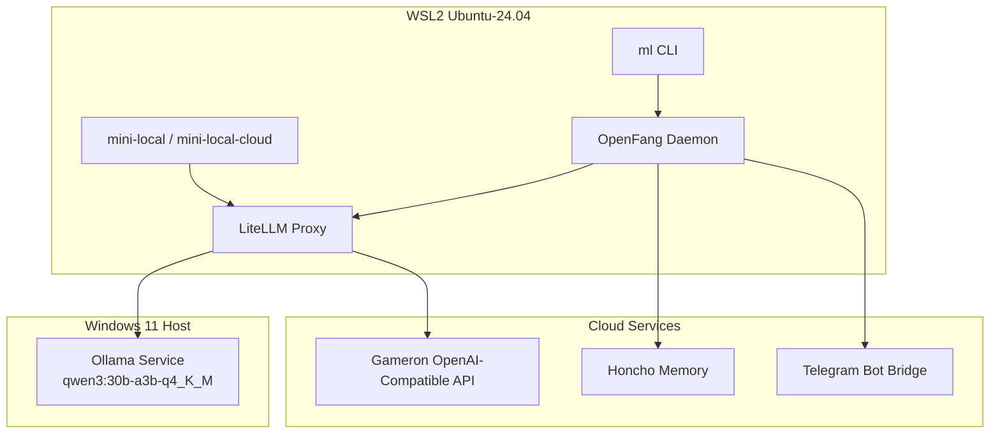

# LocalManus

LocalManus is Justin's persistent local Manus environment running in WSL on top of a Windows Ollama host, LiteLLM, OpenFang, Honcho, and helper CLIs.

The current supported operator path is:
- `ml task` -> OpenFang `assistant`
- `assistant` -> LiteLLM at `http://localhost:4000/v1`
- LiteLLM default -> `gpt-5.4` (Gameron API)
- code-heavy `ml task` prompts -> direct LiteLLM `gpt-5.3-codex` path (bypasses OpenFang tool loop)

The `orchestrator` agent is still not part of the supported path.

Dynamic routing behavior:
- `assistant` remains the single LocalManus identity and Honcho entity.
- Default model is `gpt-5.4`.
- `ml task` routes code-heavy prompts to direct `gpt-5.3-codex` calls first.
- `ml task` routes deep-reasoning/high-stakes prompts to `claude-opus-4-6`.
- Local Ollama models remain configured as fallback paths, not primaries.
- If direct code routing fails, `ml task` falls back to the OpenFang assistant path automatically.

## Architecture



## Working Runtime

As of April 4, 2026, the stable LocalManus runtime is:
- OpenFang `0.5.5`
- LiteLLM on `localhost:4000`
- OpenFang daemon on `localhost:50051`
- startup-time assistant reconciliation via `scripts/reconcile_openfang_assistant.sh`
- `ml task` resolving the live assistant ID from the daemon API instead of trusting cached CLI output

## Commands

### ManusLocal CLI

```bash
ml status
ml task 'your task here'
ml mini 'your coding task'
ml delegate 'task for cloud Manus'
ml memory query 'question'
ml memory flush
ml relay send --to claude --from codex --kind blocker 'Need decision on API schema'
ml relay peek --for claude
ml relay ack <message-id> --for claude --by claude
ml relay poll --for claude --timeout 120 --interval 2
```

### Real-time Relay (`~/.agent-inbox`)

Honcho remains the persistent memory layer. For immediate handoff/blocker signals between Codex and Claude Desktop, use file relay inboxes:
- Path: `~/.agent-inbox/<agent>.json`
- Queue semantics: append-only message list with `pending` -> `acked` transitions
- Primary flow:
  - Codex sends: `ml relay send --to claude --from codex --kind blocker '...message...'`
  - Claude bootstrap/poll reads: `ml relay peek --for claude` or `ml relay poll --for claude`
  - Claude acknowledges: `ml relay ack <message-id> --for claude --by claude`

### OpenFang

```bash
~/.openfang/bin/openfang --version
curl http://127.0.0.1:50051/api/health
openfang agent list
openfang chat assistant
```

### Startup

```bash
bash ~/projects/LocalManus/scripts/start_manuslocal.sh
bash ~/projects/LocalManus/scripts/start_manuslocal.sh --background
```

## OpenFang Repair Summary

The April 4 repair fixed three concrete issues:
1. The persisted `assistant` agent had stale model credentials and could crash or hang inside the OpenFang runtime.
2. `ml task` could target a stale assistant UUID after the daemon replaced the agent at startup.
3. OpenFang `0.5.1` was materially less stable than the current installed runtime.

Current repair artifacts:
- `config/openfang_assistant.toml`
- `scripts/reconcile_openfang_assistant.sh`
- `tools/ml_cli.py`

Detailed operator notes live in `docs/openfang-runtime-repair-2026-04-04.md`.

## File Locations

| File | Purpose |
|---|---|
| `config/litellm_config.yaml` | LiteLLM routing and fallback chain |
| `config/openfang_assistant.toml` | Clean replacement manifest for the LocalManus assistant |
| `config/openfang_assistant_no_tools.toml` | Assistant fallback manifest used by tool-wrapper recovery logic |
| `scripts/reconcile_openfang_assistant.sh` | Startup-time repair for the assistant agent |
| `scripts/start_litellm.sh` | Starts LiteLLM with WSL/Windows Ollama bridge logic |
| `scripts/start_manuslocal.sh` | Main LocalManus startup path |
| `logs/last_honcho_post_task.txt` | Last Honcho post-task session + summary emitted by the mini wrappers |
| `tools/ml_cli.py` | `ml` CLI implementation |
| `docs/openfang-runtime-repair-2026-04-04.md` | Detailed repair playbook and troubleshooting |
| `docs/claude_relay_bootstrap.md` | Real-time Codex <-> Claude relay inbox workflow |

## Ports and Services

| Service | Port | Notes |
|---|---|---|
| Ollama (Windows) | 11434 | Reachable from WSL via default gateway |
| LiteLLM | 4000 | OpenAI-compatible proxy |
| OpenFang | 50051 | Daemon API + Telegram bridge |

## Recommended Verification

```bash
curl -s http://localhost:50051/api/health
curl -s -H "Authorization: Bearer $LITELLM_KEY" http://localhost:4000/v1/models
openfang agent list
ml task 'Reply with exactly READY.'
```

## Recent Fixes

1. `mini-local-cloud` was aligned to `claude-sonnet-4-6`.
2. `ml task` was pinned to the assistant-first task path.
3. OpenFang was upgraded to `0.5.5`.
4. Assistant runtime startup now reconciles to a clean manifest instead of reusing the poisoned persisted agent state.
5. Telegram bot transport was validated with the configured bot token and chat ID.
6. Cloud-first model routing now defaults to `gpt-5.4` with dynamic switches to `gpt-5.3-codex` and `claude-opus-4-6`.
7. `ml task` now includes direct code routing and function-wrapper fallback handling for OpenFang tool-call normalization issues.
8. `mini_local` and `mini_local_cloud` now persist the Honcho post-task output to `logs/last_honcho_post_task.txt` and print the compact summary so downstream relay tooling can reuse it.

## Notes

- Keep `orchestrator` out of the critical path unless it is explicitly repaired and revalidated.
- Treat `assistant` as the supported LocalManus task ingress.
- If the assistant starts failing again, follow `docs/openfang-runtime-repair-2026-04-04.md` before changing unrelated components.
- Upstream tracking: keep an open issue for OpenFang tool-wrapper normalization (`function` / `function_name` vs declared tool name) and remove the direct-code/fallback workaround once upstream behavior is stable.
