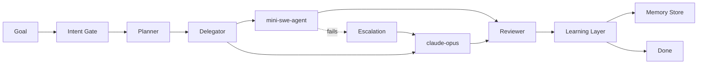

# JustAi Demo-Readiness Implementation Plan

> **For agentic workers:** REQUIRED SUB-SKILL: Use superpowers:subagent-driven-development (recommended) or superpowers:executing-plans to implement this plan task-by-task. Steps use checkbox (`- [ ]`) syntax for tracking.

**Goal:** Build a self-contained interactive demo shell that replicates the JustAi dashboard with mock data and a choreographed 60-second sprint simulation, plus revise the justai-demo README.

**Architecture:** A React component bundle (`dashboard/demo/`) with its own state management via a `useSimulation` hook that drives a deterministic state machine. All 7 dashboard views are replicated with embedded mock data. No backend dependencies. CSS variables match the real dashboard's Glass Aurora theme for pixel-identical visuals.

**Tech Stack:** React 18, TypeScript, Recharts (charts), CSS custom properties (theming). No additional dependencies beyond what's already in `dashboard/package.json`.

**Spec:** `docs/superpowers/specs/2026-04-16-demo-readiness-design.md`

---

## File Structure

```
dashboard/demo/
├── JustAiDemo.tsx              # Top-level: layout grid, view router, wires simulation
├── demo-entry.tsx              # Standalone mount point for dev (temporary)
├── hooks/
│   └── useSimulation.ts        # State machine, timer, speed control, derived state
├── data/
│   ├── types.ts                # All TypeScript types for the demo
│   └── sprint-timeline.ts      # 8-task scenario, events, mock payloads
├── views/
│   ├── DemoMissionControl.tsx   # Stats, pipeline, active banner, services, runs
│   ├── DemoTaskBoard.tsx        # 5-column Kanban with animated cards
│   ├── DemoRunHistory.tsx       # Run entry, event log
│   ├── DemoTrajectories.tsx     # File list, 3-mode analysis, command replay
│   ├── DemoMemory.tsx           # Memory entries, live insertion
│   ├── DemoObservability.tsx    # Recharts: cost, latency, quality
│   └── DemoAgents.tsx           # Agent cards with status
├── components/
│   ├── DemoSidebar.tsx          # Nav groups, logo, theme toggle, badge counts
│   └── SprintBar.tsx            # Play/Pause, speed, progress (demo-only)
└── styles/
    └── demo-theme.css           # CSS variables (copy of real theme)
dashboard/demo.html              # Dev entry point (multi-page Vite)
```

---

## Task 1: Branch Setup & Directory Scaffold

**Files:**
- Create: `dashboard/demo/` directory tree
- Create: `dashboard/demo.html`
- Create: `dashboard/demo/demo-entry.tsx`
- Modify: `dashboard/vite.config.ts` (add multi-page entry)

- [ ] **Step 1: Create the demo-build branch**

```bash
cd /home/justinleopard/projects/JustAi
git checkout -b demo-build
```

- [ ] **Step 2: Create directory structure**

```bash
mkdir -p dashboard/demo/{hooks,data,views,components,styles}
```

- [ ] **Step 3: Create demo.html entry point**

Create `dashboard/demo.html`:

```html
<!DOCTYPE html>
<html lang="en">
  <head>
    <meta charset="UTF-8" />
    <meta name="viewport" content="width=device-width, initial-scale=1.0" />
    <title>JustAi Demo</title>
  </head>
  <body>
    <div id="demo-root"></div>
    <script type="module" src="/demo/demo-entry.tsx"></script>
  </body>
</html>
```

- [ ] **Step 4: Create demo-entry.tsx mount point**

Create `dashboard/demo/demo-entry.tsx`:

```tsx
import { StrictMode } from 'react'
import { createRoot } from 'react-dom/client'
import JustAiDemo from './JustAiDemo'
import '../src/styles/theme.css'
import './styles/demo-theme.css'

createRoot(document.getElementById('demo-root')!).render(
  <StrictMode>
    <JustAiDemo />
  </StrictMode>
)
```

- [ ] **Step 5: Add demo.html as Vite multi-page entry**

In `dashboard/vite.config.ts`, add `demo.html` to the `build.rollupOptions.input` object. Find the existing `defineConfig` and add:

```ts
build: {
  rollupOptions: {
    input: {
      main: resolve(__dirname, 'index.html'),
      demo: resolve(__dirname, 'demo.html'),
    },
  },
},
```

Add `import { resolve } from 'path'` at top if not already present.

- [ ] **Step 6: Create placeholder JustAiDemo.tsx**

Create `dashboard/demo/JustAiDemo.tsx`:

```tsx
export default function JustAiDemo() {
  return <div style={{ color: 'white', padding: 40 }}>JustAi Demo Shell — Loading...</div>
}
```

- [ ] **Step 7: Verify dev server serves demo page**

```bash
cd /home/justinleopard/projects/JustAi/dashboard
npm run dev
```

Open `http://localhost:3001/demo.html` — should show "JustAi Demo Shell — Loading..."

- [ ] **Step 8: Commit**

```bash
git add dashboard/demo/ dashboard/demo.html dashboard/vite.config.ts
git commit -m "chore: scaffold demo-build branch with directory structure and dev entry"
```

---

## Task 2: Types & Sprint Timeline Data

**Files:**
- Create: `dashboard/demo/data/types.ts`
- Create: `dashboard/demo/data/sprint-timeline.ts`

- [ ] **Step 1: Create types.ts**

Create `dashboard/demo/data/types.ts`:

```ts
export type DemoTaskStatus = 'pending' | 'claimed' | 'in_progress' | 'done' | 'failed'

export interface DemoTask {
  id: number
  name: string
  agent: string
  model: string
  status: DemoTaskStatus
  cost: number
  steps: number
  stepsDone: number
  escalated: boolean
  escalatedFrom?: string
  trajectoryLearning: boolean
  payload: string
  result: string
}

export interface DemoAgent {
  id: string
  name: string
  model: string
  status: 'idle' | 'active'
  tasksCompleted: number
  currentTaskId: number | null
}

export type PipelineStage = 'intent' | 'plan' | 'execute' | 'review' | 'synthesize'
export type StageStatus = 'idle' | 'active' | 'done'

export interface DemoMemoryEntry {
  id: string
  key: string
  value: string
  category: string
  appearsAt: number // seconds into simulation when this entry becomes visible
}

export interface DemoEvent {
  time: number
  type: string
  detail: string
}

export type SimPhase = 'idle' | 'planning' | 'executing' | 'reviewing' | 'complete'
export type SpeedMultiplier = 0.5 | 1 | 2

export interface SimulationState {
  phase: SimPhase
  elapsed: number
  speed: SpeedMultiplier
  paused: boolean
  tasks: DemoTask[]
  agents: DemoAgent[]
  pipeline: Record<PipelineStage, StageStatus>
  memories: DemoMemoryEntry[]
  events: DemoEvent[]
  totalCost: number
  avgLatency: number
  successRate: number
  completedCount: number
}

export type TimelineAction =
  | 'start_sprint'
  | 'set_phase'
  | 'set_pipeline'
  | 'claim_task'
  | 'start_task'
  | 'complete_task'
  | 'fail_task'
  | 'escalate_task'
  | 'add_event'

export interface TimelineEntry {
  time: number
  action: TimelineAction
  taskId?: number
  agent?: string
  model?: string
  phase?: SimPhase
  pipeline?: Partial<Record<PipelineStage, StageStatus>>
  detail?: string
  cost?: number
}

export type DemoView =
  | 'mission-control'
  | 'task-board'
  | 'runs'
  | 'trajectories'
  | 'memory'
  | 'observability'
  | 'agents'
```

- [ ] **Step 2: Create sprint-timeline.ts**

Create `dashboard/demo/data/sprint-timeline.ts`:

```ts
import type { DemoTask, DemoAgent, DemoMemoryEntry, TimelineEntry } from './types'

export const SPRINT_GOAL = 'Build a customer analytics dashboard with real-time metrics, user segmentation, and export capabilities'

export const INITIAL_TASKS: DemoTask[] = [
  { id: 1, name: 'Design API schema & data models', agent: '', model: '', status: 'pending', cost: 0, steps: 8, stepsDone: 0, escalated: false, trajectoryLearning: false, payload: 'Define PostgreSQL schema for metrics, users, segments. Design REST API contract with OpenAPI spec.', result: '' },
  { id: 2, name: 'Build metrics ingestion pipeline', agent: '', model: '', status: 'pending', cost: 0, steps: 12, stepsDone: 0, escalated: false, trajectoryLearning: false, payload: 'Create async pipeline: receive metric events via POST /api/metrics, validate, batch insert into time-series table. Add rate limiting.', result: '' },
  { id: 3, name: 'Create REST endpoints (CRUD + aggregation)', agent: '', model: '', status: 'pending', cost: 0, steps: 15, stepsDone: 0, escalated: false, trajectoryLearning: false, payload: 'Implement /api/dashboards CRUD, /api/metrics/aggregate with time bucketing, /api/users with pagination. Add auth middleware.', result: '' },
  { id: 4, name: 'Implement user segmentation engine', agent: '', model: '', status: 'pending', cost: 0, steps: 18, stepsDone: 0, escalated: false, trajectoryLearning: false, payload: 'Build dynamic segment builder: parse filter DSL, generate optimized SQL with CTEs and window functions, cache hot segments.', result: '' },
  { id: 5, name: 'Build React dashboard components', agent: '', model: '', status: 'pending', cost: 0, steps: 14, stepsDone: 0, escalated: false, trajectoryLearning: true, payload: 'Create MetricCard, TimeSeriesChart, SegmentPicker, FilterBar components. Wire to API with SWR. Add responsive grid layout.', result: '' },
  { id: 6, name: 'Add real-time WebSocket updates', agent: '', model: '', status: 'pending', cost: 0, steps: 10, stepsDone: 0, escalated: false, trajectoryLearning: false, payload: 'Set up WebSocket server on /ws/metrics. Push metric updates to connected clients. Add reconnection with exponential backoff.', result: '' },
  { id: 7, name: 'CSV/PDF export with background jobs', agent: '', model: '', status: 'pending', cost: 0, steps: 9, stepsDone: 0, escalated: false, trajectoryLearning: false, payload: 'Add POST /api/export endpoint. Queue export jobs via Redis. Generate CSV with streaming writes. PDF via Puppeteer. Presigned download URLs.', result: '' },
  { id: 8, name: 'Integration tests + CI setup', agent: '', model: '', status: 'pending', cost: 0, steps: 11, stepsDone: 0, escalated: false, trajectoryLearning: false, payload: 'Write pytest integration tests against test DB. Set up GitHub Actions: lint, typecheck, test, build. Add coverage threshold (80%).', result: '' },
]

export const INITIAL_AGENTS: DemoAgent[] = [
  { id: 'mini-1', name: 'mini-swe-agent', model: 'gpt-5.4', status: 'idle', tasksCompleted: 0, currentTaskId: null },
  { id: 'mini-2', name: 'mini-swe-agent', model: 'gpt-5.4', status: 'idle', tasksCompleted: 0, currentTaskId: null },
  { id: 'opus-1', name: 'claude-opus', model: 'claude-opus-4-6', status: 'idle', tasksCompleted: 0, currentTaskId: null },
]

export const INITIAL_MEMORIES: DemoMemoryEntry[] = [
  { id: 'mem-1', key: 'architecture/api-pattern', value: 'RESTful with versioned endpoints. Use Express + Zod validation. Session-based auth via HttpOnly cookies.', category: 'architecture', appearsAt: 0 },
  { id: 'mem-2', key: 'model/preference', value: 'Use mini-swe-agent (gpt-5.4) for implementation tasks. Reserve claude-opus for architecture and complex logic.', category: 'routing', appearsAt: 0 },
  { id: 'mem-3', key: 'testing/strategy', value: 'Integration tests over unit tests for API routes. Mock only external services (Stripe, email). Use test DB with migrations.', category: 'testing', appearsAt: 0 },
  { id: 'mem-4', key: 'sprint/charting-pattern', value: 'Recharts with responsive containers. Use ComposedChart for mixed bar+line. Custom tooltip with dark theme matching dashboard.', category: 'learning', appearsAt: 0 },
  { id: 'mem-5', key: 'deploy/ci-config', value: 'GitHub Actions: Node 20, pnpm, parallel lint+test. Deploy to Railway on main merge. Preview deploys on PRs.', category: 'infrastructure', appearsAt: 0 },
  { id: 'mem-6', key: 'escalation/segmentation-complexity', value: 'Segmentation queries with nested CTEs and window functions exceed mini-swe-agent capability. Route to claude-opus for complex SQL generation.', category: 'learning', appearsAt: 25 },
]

export const TASK_RESULTS: Record<number, string> = {
  1: 'Schema designed: 6 tables (metrics, users, segments, dashboards, exports, sessions). OpenAPI spec generated with 14 endpoints.',
  2: 'Pipeline operational: 2,400 events/sec throughput. Batch inserts (500/batch). Rate limit: 100 req/s per API key.',
  3: '14 endpoints implemented. Aggregation supports 5 time buckets (1m, 5m, 1h, 1d, 1w). Pagination via cursor. Auth middleware with JWT.',
  4: 'Segment engine handles AND/OR/NOT filters across 12 user properties. CTE-based SQL with query plan optimization. Cache TTL: 5min for hot segments.',
  5: '6 React components built. Responsive grid (1-3 columns). SWR with 30s revalidation. Dark/light theme support. Trajectory match: Recharts pattern from Sprint 7.',
  6: 'WebSocket server on /ws/metrics. Pub/sub via Redis. Reconnect with jittered backoff (1s-30s). Connection limit: 1000 concurrent.',
  7: 'Export queue via BullMQ. CSV streaming (no memory spike on 1M rows). PDF via Puppeteer with chart screenshots. S3 presigned URLs (1h TTL).',
  8: '47 integration tests (all passing). Coverage: 84%. CI pipeline: 3m12s. Lint + typecheck + test + build. Deploy gate on main.',
}

// Timeline: every event that happens during the 60-second simulation
export const TIMELINE: TimelineEntry[] = [
  // === Sprint Start (0s) ===
  { time: 0, action: 'start_sprint', detail: 'Sprint started: Build customer analytics dashboard' },
  { time: 0, action: 'set_phase', phase: 'planning' },
  { time: 0, action: 'set_pipeline', pipeline: { intent: 'active' } },
  { time: 0, action: 'add_event', detail: 'Intent classified: full-stack application (confidence: 0.94)' },
  { time: 1, action: 'set_pipeline', pipeline: { intent: 'done', plan: 'active' } },
  { time: 1, action: 'add_event', detail: 'Goal decomposed into 8 tasks across backend, frontend, and infrastructure' },
  { time: 2, action: 'set_pipeline', pipeline: { plan: 'done', execute: 'active' } },
  { time: 2, action: 'set_phase', phase: 'executing' },

  // === Task 1: API Schema (3s-8s) ===
  { time: 3, action: 'claim_task', taskId: 1, agent: 'opus-1', model: 'claude-opus-4-6' },
  { time: 3, action: 'start_task', taskId: 1, detail: 'claude-opus designing API schema and data models' },
  { time: 8, action: 'complete_task', taskId: 1, cost: 0.42, detail: 'API schema complete: 6 tables, 14 endpoints' },

  // === Tasks 2+3: Parallel (8s-16s) ===
  { time: 8, action: 'claim_task', taskId: 2, agent: 'mini-1', model: 'gpt-5.4' },
  { time: 8, action: 'start_task', taskId: 2, detail: 'mini-swe-agent building metrics ingestion pipeline' },
  { time: 8, action: 'claim_task', taskId: 3, agent: 'mini-2', model: 'gpt-5.4' },
  { time: 8, action: 'start_task', taskId: 3, detail: 'mini-swe-agent creating REST endpoints' },
  { time: 16, action: 'complete_task', taskId: 2, cost: 0.18, detail: 'Metrics pipeline operational: 2,400 events/sec' },
  { time: 16, action: 'complete_task', taskId: 3, cost: 0.22, detail: 'REST endpoints complete: 14 routes with auth' },

  // === Task 4: Segmentation — Fails then Escalates (16s-32s) ===
  { time: 16, action: 'claim_task', taskId: 4, agent: 'mini-1', model: 'gpt-5.4' },
  { time: 16, action: 'start_task', taskId: 4, detail: 'mini-swe-agent attempting segmentation engine' },
  { time: 22, action: 'fail_task', taskId: 4, detail: 'mini-swe-agent failed: complex CTE/window function query exceeds capability' },
  { time: 22, action: 'add_event', detail: 'Escalation triggered for task #4 — routing to stronger model' },
  { time: 25, action: 'escalate_task', taskId: 4, agent: 'opus-1', model: 'claude-opus-4-6', detail: 'Task #4 escalated to claude-opus' },
  { time: 25, action: 'start_task', taskId: 4, detail: 'claude-opus implementing segmentation engine (escalated)' },
  { time: 32, action: 'complete_task', taskId: 4, cost: 0.58, detail: 'Segmentation engine complete: CTE-based SQL with cache' },

  // === Task 5: React Components — Trajectory Learning (32s-38s) ===
  { time: 32, action: 'claim_task', taskId: 5, agent: 'mini-1', model: 'gpt-5.4' },
  { time: 32, action: 'start_task', taskId: 5, detail: 'mini-swe-agent building React dashboard (trajectory match: Recharts pattern from Sprint 7)' },
  { time: 32, action: 'add_event', detail: 'Trajectory learning: matched prior charting pattern — applying Recharts approach' },
  { time: 38, action: 'complete_task', taskId: 5, cost: 0.19, detail: 'React components built: 6 components, responsive grid' },

  // === Task 6: WebSocket (38s-44s) ===
  { time: 38, action: 'claim_task', taskId: 6, agent: 'mini-2', model: 'gpt-5.4' },
  { time: 38, action: 'start_task', taskId: 6, detail: 'mini-swe-agent adding WebSocket real-time updates' },
  { time: 44, action: 'complete_task', taskId: 6, cost: 0.15, detail: 'WebSocket server operational with Redis pub/sub' },

  // === Task 7: Export (44s-50s) ===
  { time: 44, action: 'claim_task', taskId: 7, agent: 'mini-1', model: 'gpt-5.4' },
  { time: 44, action: 'start_task', taskId: 7, detail: 'mini-swe-agent implementing CSV/PDF export' },
  { time: 50, action: 'complete_task', taskId: 7, cost: 0.14, detail: 'Export system: CSV streaming + PDF via Puppeteer' },

  // === Task 8: Tests + CI (50s-56s) ===
  { time: 50, action: 'claim_task', taskId: 8, agent: 'mini-2', model: 'gpt-5.4' },
  { time: 50, action: 'start_task', taskId: 8, detail: 'mini-swe-agent writing integration tests and CI setup' },
  { time: 56, action: 'complete_task', taskId: 8, cost: 0.26, detail: '47 tests passing, 84% coverage, CI pipeline: 3m12s' },

  // === Review + Complete (56s-60s) ===
  { time: 56, action: 'set_pipeline', pipeline: { execute: 'done', review: 'active' } },
  { time: 56, action: 'set_phase', phase: 'reviewing' },
  { time: 56, action: 'add_event', detail: 'All 8 tasks complete — entering review cycle' },
  { time: 58, action: 'set_pipeline', pipeline: { review: 'done', synthesize: 'active' } },
  { time: 58, action: 'add_event', detail: 'Review passed: all outputs validated, tests green, coverage met' },
  { time: 60, action: 'set_pipeline', pipeline: { synthesize: 'done' } },
  { time: 60, action: 'set_phase', phase: 'complete' },
  { time: 60, action: 'add_event', detail: 'Sprint complete — 8/8 tasks done, $2.14 total cost, 100% success rate' },
]

// Cost data points for Observability charts (cumulative after each task)
export const COST_SERIES = [
  { task: 'T1: Schema', cost: 0.42, model: 'claude-opus', cumulative: 0.42 },
  { task: 'T2: Pipeline', cost: 0.18, model: 'gpt-5.4', cumulative: 0.60 },
  { task: 'T3: REST', cost: 0.22, model: 'gpt-5.4', cumulative: 0.82 },
  { task: 'T4: Segment', cost: 0.58, model: 'claude-opus', cumulative: 1.40 },
  { task: 'T5: React', cost: 0.19, model: 'gpt-5.4', cumulative: 1.59 },
  { task: 'T6: WebSocket', cost: 0.15, model: 'gpt-5.4', cumulative: 1.74 },
  { task: 'T7: Export', cost: 0.14, model: 'gpt-5.4', cumulative: 1.88 },
  { task: 'T8: Tests', cost: 0.26, model: 'gpt-5.4', cumulative: 2.14 },
]

// Latency data points per task (seconds)
export const LATENCY_SERIES = [
  { task: 'T1', avg: 14.2, p50: 12.1, p90: 18.3, p99: 22.0 },
  { task: 'T2', avg: 11.8, p50: 10.4, p90: 15.2, p99: 19.1 },
  { task: 'T3', avg: 10.6, p50: 9.8, p90: 13.7, p99: 17.4 },
  { task: 'T4', avg: 16.9, p50: 14.5, p90: 21.3, p99: 28.7 },
  { task: 'T5', avg: 9.4, p50: 8.7, p90: 12.1, p99: 15.0 },
  { task: 'T6', avg: 12.1, p50: 11.0, p90: 14.8, p99: 18.2 },
  { task: 'T7', avg: 11.3, p50: 10.1, p90: 14.0, p99: 17.6 },
  { task: 'T8', avg: 12.9, p50: 11.8, p90: 15.5, p99: 19.3 },
]

// Trajectory mock data for Post-Mortem view
export const TRAJECTORY_COMMANDS: Record<number, Array<{ step: number; tool: string; command: string; result: string }>> = {
  4: [
    { step: 1, tool: 'bash', command: 'grep -r "segment" --include="*.py" -l', result: 'src/models/segment.py\nsrc/api/segments.py' },
    { step: 2, tool: 'bash', command: 'cat src/models/segment.py', result: '# Segment model with filter DSL...' },
    { step: 3, tool: 'bash', command: 'python3 -c "from src.segment_engine import build_query; print(build_query({\'age_gt\': 25}))"', result: 'ERROR: RecursionError in CTE generation for nested OR clauses' },
    { step: 4, tool: 'bash', command: '# ESCALATION: Query complexity exceeds mini-swe-agent capability', result: 'Routing to claude-opus for complex SQL generation' },
    { step: 5, tool: 'bash', command: 'cat src/segment_engine.py | head -80', result: '# Refactored segment engine with optimized CTEs...' },
    { step: 6, tool: 'bash', command: 'python3 -m pytest tests/test_segments.py -v', result: '12 passed in 2.34s' },
  ],
  5: [
    { step: 1, tool: 'bash', command: 'ls src/components/', result: 'MetricCard.tsx\nTimeSeriesChart.tsx\nFilterBar.tsx' },
    { step: 2, tool: 'bash', command: '# TRAJECTORY MATCH: Sprint 7 charting pattern (Recharts + ComposedChart)', result: 'Applying learned pattern: responsive containers + custom tooltips' },
    { step: 3, tool: 'bash', command: 'cat src/components/TimeSeriesChart.tsx', result: '// Recharts ComposedChart with bars + lines...' },
    { step: 4, tool: 'bash', command: 'npm run typecheck', result: 'No errors found.' },
    { step: 5, tool: 'bash', command: 'npm run dev -- --port 3002', result: 'Server running at http://localhost:3002' },
  ],
}
```

- [ ] **Step 3: Verify types compile**

```bash
cd /home/justinleopard/projects/JustAi/dashboard
npx tsc --noEmit demo/data/types.ts demo/data/sprint-timeline.ts
```

Expected: No errors.

- [ ] **Step 4: Commit**

```bash
git add dashboard/demo/data/
git commit -m "feat(demo): add types and sprint timeline data"
```

---

## Task 3: Simulation Engine — useSimulation Hook

**Files:**
- Create: `dashboard/demo/hooks/useSimulation.ts`
- Create: `dashboard/demo/hooks/__tests__/useSimulation.test.ts` (optional, verify logic)

- [ ] **Step 1: Create useSimulation.ts**

Create `dashboard/demo/hooks/useSimulation.ts`:

```ts
import { useState, useCallback, useRef, useEffect } from 'react'
import type {
  SimulationState, SpeedMultiplier, DemoTask, DemoAgent,
  PipelineStage, StageStatus, TimelineEntry,
} from '../data/types'
import {
  INITIAL_TASKS, INITIAL_AGENTS, INITIAL_MEMORIES,
  TIMELINE, TASK_RESULTS,
} from '../data/sprint-timeline'

const TICK_MS = 100 // 10 ticks per second base

function makeInitialState(): SimulationState {
  return {
    phase: 'idle',
    elapsed: 0,
    speed: 1,
    paused: true,
    tasks: INITIAL_TASKS.map(t => ({ ...t })),
    agents: INITIAL_AGENTS.map(a => ({ ...a })),
    pipeline: { intent: 'idle', plan: 'idle', execute: 'idle', review: 'idle', synthesize: 'idle' },
    memories: INITIAL_MEMORIES.filter(m => m.appearsAt === 0),
    events: [],
    totalCost: 0,
    avgLatency: 0,
    successRate: 0,
    completedCount: 0,
  }
}

function applyEvent(state: SimulationState, entry: TimelineEntry): SimulationState {
  const next = { ...state }
  next.tasks = next.tasks.map(t => ({ ...t }))
  next.agents = next.agents.map(a => ({ ...a }))

  switch (entry.action) {
    case 'start_sprint':
      break

    case 'set_phase':
      if (entry.phase) next.phase = entry.phase
      break

    case 'set_pipeline':
      if (entry.pipeline) {
        next.pipeline = { ...next.pipeline }
        for (const [k, v] of Object.entries(entry.pipeline)) {
          next.pipeline[k as PipelineStage] = v as StageStatus
        }
      }
      break

    case 'claim_task': {
      const task = next.tasks.find(t => t.id === entry.taskId)
      if (task && entry.agent && entry.model) {
        task.status = 'claimed'
        task.agent = entry.agent
        task.model = entry.model
        const agent = next.agents.find(a => a.id === entry.agent)
        if (agent) {
          agent.status = 'active'
          agent.currentTaskId = task.id
        }
      }
      break
    }

    case 'start_task': {
      const task = next.tasks.find(t => t.id === entry.taskId)
      if (task) task.status = 'in_progress'
      break
    }

    case 'complete_task': {
      const task = next.tasks.find(t => t.id === entry.taskId)
      if (task) {
        task.status = 'done'
        task.cost = entry.cost ?? task.cost
        task.stepsDone = task.steps
        task.result = TASK_RESULTS[task.id] ?? 'Completed successfully.'
        const agent = next.agents.find(a => a.id === task.agent)
        if (agent) {
          agent.tasksCompleted++
          agent.currentTaskId = null
          // Set idle only if no other task is assigned to this agent
          const hasOtherTask = next.tasks.some(
            t => t.id !== task.id && t.agent === agent.id &&
            (t.status === 'claimed' || t.status === 'in_progress')
          )
          if (!hasOtherTask) agent.status = 'idle'
        }
        next.totalCost = next.tasks.reduce((sum, t) => sum + t.cost, 0)
        next.completedCount = next.tasks.filter(t => t.status === 'done').length
        next.successRate = next.completedCount > 0 ? 100 : 0
      }
      break
    }

    case 'fail_task': {
      const task = next.tasks.find(t => t.id === entry.taskId)
      if (task) {
        task.status = 'failed'
        const agent = next.agents.find(a => a.id === task.agent)
        if (agent) {
          agent.currentTaskId = null
          agent.status = 'idle'
        }
      }
      break
    }

    case 'escalate_task': {
      const task = next.tasks.find(t => t.id === entry.taskId)
      if (task && entry.agent && entry.model) {
        task.escalatedFrom = task.agent
        task.agent = entry.agent
        task.model = entry.model
        task.status = 'claimed'
        task.escalated = true
        task.stepsDone = 0
        const newAgent = next.agents.find(a => a.id === entry.agent)
        if (newAgent) {
          newAgent.status = 'active'
          newAgent.currentTaskId = task.id
        }
      }
      break
    }

    case 'add_event':
      break // handled below
  }

  // Always add event to log
  if (entry.detail) {
    next.events = [...next.events, { time: entry.time, type: entry.action, detail: entry.detail }]
  }

  // Check for new memories that should appear
  next.memories = INITIAL_MEMORIES.filter(m => m.appearsAt <= next.elapsed)

  // Compute avg latency from completed tasks
  const done = next.tasks.filter(t => t.status === 'done')
  if (done.length > 0) {
    // Simulated latency: steps * ~1.5s per step
    next.avgLatency = +(done.reduce((sum, t) => sum + (t.steps * 1.5), 0) / done.length).toFixed(1)
  }

  return next
}

export function useSimulation() {
  const [state, setState] = useState<SimulationState>(makeInitialState)
  const processedRef = useRef<Set<number>>(new Set())
  const intervalRef = useRef<ReturnType<typeof setInterval> | null>(null)

  const play = useCallback(() => setState(s => ({ ...s, paused: false })), [])
  const pause = useCallback(() => setState(s => ({ ...s, paused: true })), [])
  const setSpeed = useCallback((speed: SpeedMultiplier) => setState(s => ({ ...s, speed })), [])

  const reset = useCallback(() => {
    processedRef.current = new Set()
    setState(makeInitialState())
  }, [])

  const replay = useCallback(() => {
    processedRef.current = new Set()
    setState({ ...makeInitialState(), paused: false })
  }, [])

  useEffect(() => {
    if (intervalRef.current) clearInterval(intervalRef.current)

    intervalRef.current = setInterval(() => {
      setState(prev => {
        if (prev.paused || prev.phase === 'complete') return prev

        const newElapsed = +(prev.elapsed + (TICK_MS / 1000) * prev.speed).toFixed(2)

        // Find and apply all timeline entries that should fire
        let next = { ...prev, elapsed: newElapsed }
        for (let i = 0; i < TIMELINE.length; i++) {
          if (!processedRef.current.has(i) && TIMELINE[i].time <= newElapsed) {
            processedRef.current.add(i)
            next = applyEvent(next, TIMELINE[i])
          }
        }

        // Animate step progress for in-progress tasks
        next.tasks = next.tasks.map(t => {
          if (t.status === 'in_progress' && t.stepsDone < t.steps) {
            return { ...t, stepsDone: Math.min(t.steps, t.stepsDone + 0.05 * prev.speed) }
          }
          return t
        })

        return next
      })
    }, TICK_MS)

    return () => {
      if (intervalRef.current) clearInterval(intervalRef.current)
    }
  }, [])

  return { state, play, pause, setSpeed, reset, replay }
}
```

- [ ] **Step 2: Verify hook compiles**

```bash
cd /home/justinleopard/projects/JustAi/dashboard
npx tsc --noEmit demo/hooks/useSimulation.ts
```

Expected: No errors.

- [ ] **Step 3: Commit**

```bash
git add dashboard/demo/hooks/
git commit -m "feat(demo): add useSimulation state machine hook"
```

---

## Task 4: Demo Theme CSS

**Files:**
- Create: `dashboard/demo/styles/demo-theme.css`

- [ ] **Step 1: Create demo-theme.css**

Copy the real theme from `dashboard/src/styles/theme.css` into `dashboard/demo/styles/demo-theme.css`. This ensures the demo uses identical CSS variables. Read the real file and copy its full contents:

```bash
cp dashboard/src/styles/theme.css dashboard/demo/styles/demo-theme.css
```

- [ ] **Step 2: Add demo-specific overrides at the end of the file**

Append to `dashboard/demo/styles/demo-theme.css`:

```css
/* === Demo-specific additions === */
#demo-root {
  height: 100vh;
  overflow: hidden;
}

.demo-sprint-bar {
  background: linear-gradient(90deg, var(--bg-elevated) 0%, var(--bg-surface) 100%);
  border-bottom: 1px solid var(--rose-900);
}

@keyframes escalate-pulse {
  0%, 100% { box-shadow: 0 0 0 0 rgba(245, 158, 11, 0.4); }
  50% { box-shadow: 0 0 12px 4px rgba(245, 158, 11, 0.2); }
}

.task-card-escalating {
  animation: escalate-pulse 1.5s ease-in-out infinite;
  border-color: var(--amber-500) !important;
}

.trajectory-learning-badge {
  background: rgba(139, 92, 246, 0.15);
  border: 1px solid rgba(139, 92, 246, 0.3);
  color: #a78bfa;
}
```

- [ ] **Step 3: Commit**

```bash
git add dashboard/demo/styles/
git commit -m "feat(demo): add theme CSS with demo-specific overrides"
```

---

## Task 5: DemoSidebar Component

**Files:**
- Create: `dashboard/demo/components/DemoSidebar.tsx`

- [ ] **Step 1: Create DemoSidebar.tsx**

Create `dashboard/demo/components/DemoSidebar.tsx`. This is a close replica of `dashboard/src/components/Sidebar.tsx` — same logo, same nav groups, same styling. Read the real `Sidebar.tsx` for exact style values, then create the demo version with these differences:
- Footer shows "Demo Mode" instead of transport status
- Badge counts come from simulation state props
- Theme toggle works via local state (no `useTheme` hook dependency)

Reference: `dashboard/src/components/Sidebar.tsx` for exact inline style values (font sizes, padding, colors, letter-spacing, border treatments, hover states).

```tsx
import { useState } from 'react'
import type { DemoView } from '../data/types'

interface NavItem { view: DemoView; label: string; icon: string }
interface NavGroup { label: string; items: NavItem[] }

const NAV_GROUPS: NavGroup[] = [
  {
    label: 'Operations',
    items: [
      { view: 'mission-control', label: 'Mission Control', icon: '\u25C9' },
      { view: 'task-board', label: 'Task Board', icon: '\u25A6' },
      { view: 'runs', label: 'Run History', icon: '\u25B8' },
    ],
  },
  {
    label: 'Intelligence',
    items: [
      { view: 'trajectories', label: 'Trajectories', icon: '\u25C8' },
      { view: 'memory', label: 'Memory', icon: '\u2B21' },
      { view: 'observability', label: 'Observability', icon: '\u25D0' },
    ],
  },
  {
    label: 'System',
    items: [
      { view: 'agents', label: 'Agents', icon: '\u2B22' },
    ],
  },
]

interface DemoSidebarProps {
  activeView: DemoView
  onNavigate: (view: DemoView) => void
  counts?: Partial<Record<DemoView, number>>
}

export function DemoSidebar({ activeView, onNavigate, counts }: DemoSidebarProps) {
  const [theme, setTheme] = useState<'dark' | 'light'>('dark')

  const toggleTheme = () => {
    const next = theme === 'dark' ? 'light' : 'dark'
    setTheme(next)
    document.documentElement.setAttribute('data-theme', next)
  }

  return (
    <aside style={{
      width: 232, minWidth: 232, maxWidth: 232, height: '100%',
      display: 'flex', flexDirection: 'column',
      background: 'var(--bg-surface)',
      borderRight: '1px solid var(--border-subtle)',
      position: 'relative', overflow: 'hidden',
    }}>
      {/* Gradient overlay */}
      <div aria-hidden style={{
        position: 'absolute', top: 0, left: 0, right: 0, height: 120,
        background: 'linear-gradient(to bottom, rgba(255,255,255,0.03) 0%, transparent 100%)',
        pointerEvents: 'none', zIndex: 0,
      }} />

      {/* Logo */}
      <div style={{ display: 'flex', alignItems: 'center', gap: 10, padding: '24px 20px 20px', position: 'relative', zIndex: 1 }}>
        <div aria-hidden style={{
          width: 18, height: 18, transform: 'rotate(45deg)',
          background: 'rgba(244,63,94,0.12)', border: '1px solid rgba(244,63,94,0.35)',
          borderRadius: 3, display: 'flex', alignItems: 'center', justifyContent: 'center',
          boxShadow: '0 0 8px rgba(244,63,94,0.2)', flexShrink: 0,
        }}>
          <div style={{ width: 7, height: 7, background: 'rgba(244,63,94,0.8)', borderRadius: 1, boxShadow: '0 0 6px rgba(244,63,94,0.6)' }} />
        </div>
        <div style={{ display: 'flex', flexDirection: 'column', gap: 1 }}>
          <span style={{ fontSize: 15, fontWeight: 300, letterSpacing: 5, color: 'var(--text-primary)', lineHeight: 1 }}>JUSTAI</span>
          <span style={{ fontSize: 10, fontWeight: 400, letterSpacing: 1.5, color: 'var(--text-dim)', lineHeight: 1 }}>v2.0</span>
        </div>
      </div>

      {/* Nav */}
      <nav style={{ flex: 1, overflowY: 'auto', padding: '4px 0', position: 'relative', zIndex: 1 }}>
        {NAV_GROUPS.map(group => (
          <div key={group.label} style={{ marginBottom: 20 }}>
            <div style={{ fontSize: 10, fontWeight: 500, textTransform: 'uppercase', letterSpacing: 2.5, color: 'var(--text-dim)', padding: '0 20px 6px' }}>
              {group.label}
            </div>
            {group.items.map(item => {
              const isActive = item.view === activeView
              const count = counts?.[item.view]
              return (
                <button key={item.view} onClick={() => onNavigate(item.view)} style={{
                  display: 'flex', alignItems: 'center', gap: 8, width: '100%', padding: '7px 20px',
                  background: isActive ? 'rgba(244,63,94,0.05)' : 'transparent',
                  border: 'none',
                  borderLeft: isActive ? '2px solid rgba(244,63,94,0.7)' : '2px solid transparent',
                  borderRight: 'none',
                  borderTop: isActive ? '1px solid rgba(244,63,94,0.07)' : '1px solid transparent',
                  borderBottom: isActive ? '1px solid rgba(244,63,94,0.07)' : '1px solid transparent',
                  cursor: 'pointer', fontSize: 13, fontWeight: 300,
                  color: isActive ? '#fce7f3' : 'var(--text-tertiary)',
                  textAlign: 'left',
                  boxShadow: isActive ? '2px 0 8px rgba(244,63,94,0.12) inset' : 'none',
                  transition: 'background 0.15s, color 0.15s, border-color 0.15s',
                }}>
                  <span aria-hidden style={{
                    fontSize: 11, opacity: isActive ? 1 : 0.5,
                    color: isActive ? 'rgba(244,63,94,0.8)' : 'inherit',
                    textShadow: isActive ? '0 0 6px rgba(244,63,94,0.5)' : 'none',
                    flexShrink: 0,
                  }}>{item.icon}</span>
                  <span style={{ flex: 1 }}>{item.label}</span>
                  {count !== undefined && (
                    <span style={{
                      fontFamily: 'var(--font-mono)', fontSize: 11,
                      color: isActive ? 'rgba(244,63,94,0.8)' : 'var(--text-dim)',
                      background: isActive ? 'rgba(244,63,94,0.1)' : 'rgba(255,255,255,0.04)',
                      padding: '1px 5px', borderRadius: 4, lineHeight: '16px',
                    }}>{count}</span>
                  )}
                </button>
              )
            })}
          </div>
        ))}
      </nav>

      {/* Footer */}
      <div style={{
        padding: '12px 20px', borderTop: '1px solid var(--border-subtle)',
        display: 'flex', alignItems: 'center', gap: 8, position: 'relative', zIndex: 1,
      }}>
        <span aria-hidden style={{
          display: 'inline-block', width: 6, height: 6, borderRadius: '50%',
          background: '#10b981', boxShadow: '0 0 4px rgba(16,185,129,0.6)',
          animation: 'breathe 2.8s ease-in-out infinite', flexShrink: 0,
        }} />
        <span style={{ flex: 1, fontSize: 11, fontWeight: 300, color: 'var(--text-dim)', letterSpacing: 0.3 }}>
          Demo Mode
        </span>
        <button onClick={toggleTheme} style={{
          background: 'none', border: 'none', cursor: 'pointer', padding: 4,
          color: 'var(--text-muted)', borderRadius: 'var(--r-sm)', fontSize: 14,
        }}>
          {theme === 'dark' ? '\u2600' : '\u263E'}
        </button>
      </div>
    </aside>
  )
}
```

- [ ] **Step 2: Commit**

```bash
git add dashboard/demo/components/DemoSidebar.tsx
git commit -m "feat(demo): add DemoSidebar component"
```

---

## Task 6: SprintBar Component

**Files:**
- Create: `dashboard/demo/components/SprintBar.tsx`

- [ ] **Step 1: Create SprintBar.tsx**

Create `dashboard/demo/components/SprintBar.tsx`:

```tsx
import type { SimulationState, SpeedMultiplier } from '../data/types'
import { SPRINT_GOAL } from '../data/sprint-timeline'

interface SprintBarProps {
  state: SimulationState
  onPlay: () => void
  onPause: () => void
  onSetSpeed: (s: SpeedMultiplier) => void
  onReplay: () => void
}

export function SprintBar({ state, onPlay, onPause, onSetSpeed, onReplay }: SprintBarProps) {
  const progress = state.phase === 'idle' ? 0 : Math.min(100, (state.completedCount / 8) * 100)
  const isComplete = state.phase === 'complete'
  const speeds: SpeedMultiplier[] = [0.5, 1, 2]

  return (
    <div className="demo-sprint-bar" style={{
      display: 'flex', alignItems: 'center', padding: '0 20px', gap: 16, height: 48,
      borderBottom: '1px solid rgba(244,63,94,0.15)', zIndex: 10,
    }}>
      {/* Demo badge */}
      <span style={{
        fontSize: 10, fontWeight: 600, letterSpacing: 2, color: 'rgba(244,63,94,0.9)',
        background: 'rgba(244,63,94,0.1)', border: '1px solid rgba(244,63,94,0.2)',
        padding: '3px 10px', borderRadius: 4, textTransform: 'uppercase', flexShrink: 0,
      }}>Demo</span>

      {/* Goal text */}
      <div style={{ flex: 1, fontSize: 12, fontWeight: 300, color: 'var(--text-muted)', letterSpacing: 0.3, overflow: 'hidden', textOverflow: 'ellipsis', whiteSpace: 'nowrap' }}>
        Sprint Goal: <strong style={{ color: 'var(--text-primary)', fontWeight: 400 }}>{SPRINT_GOAL}</strong>
      </div>

      {/* Progress bar */}
      <div style={{ width: 120, height: 3, background: 'rgba(255,255,255,0.06)', borderRadius: 2, overflow: 'hidden', flexShrink: 0 }}>
        <div style={{
          width: `${progress}%`, height: '100%', borderRadius: 2,
          background: isComplete
            ? 'linear-gradient(90deg, rgba(16,185,129,0.6), rgba(16,185,129,0.9))'
            : 'linear-gradient(90deg, rgba(244,63,94,0.6), rgba(244,63,94,0.9))',
          transition: 'width 0.5s',
        }} />
      </div>

      {/* Task count */}
      <span style={{ fontSize: 11, color: 'var(--text-dim)', fontWeight: 300, fontFamily: 'var(--font-mono)', flexShrink: 0 }}>
        {state.completedCount}/8
      </span>

      {/* Speed control */}
      <div style={{ display: 'flex', gap: 2, background: 'rgba(255,255,255,0.04)', borderRadius: 4, padding: 2, flexShrink: 0 }}>
        {speeds.map(s => (
          <button key={s} onClick={() => onSetSpeed(s)} style={{
            fontSize: 10, padding: '2px 8px', background: state.speed === s ? 'rgba(244,63,94,0.15)' : 'none',
            border: 'none', color: state.speed === s ? '#fce7f3' : 'var(--text-dim)',
            cursor: 'pointer', borderRadius: 3, fontWeight: 500,
          }}>
            {s}x
          </button>
        ))}
      </div>

      {/* Play/Pause/Replay button */}
      {isComplete ? (
        <button onClick={onReplay} style={{
          display: 'flex', alignItems: 'center', gap: 6,
          background: 'rgba(16,185,129,0.15)', border: '1px solid rgba(16,185,129,0.3)',
          color: '#a7f3d0', padding: '6px 16px', borderRadius: 6,
          fontSize: 12, fontWeight: 400, cursor: 'pointer', letterSpacing: 0.5, flexShrink: 0,
        }}>
          Replay
        </button>
      ) : (
        <button onClick={state.paused ? onPlay : onPause} style={{
          display: 'flex', alignItems: 'center', gap: 6,
          background: 'rgba(244,63,94,0.15)', border: '1px solid rgba(244,63,94,0.3)',
          color: '#fce7f3', padding: '6px 16px', borderRadius: 6,
          fontSize: 12, fontWeight: 400, cursor: 'pointer', letterSpacing: 0.5, flexShrink: 0,
        }}>
          {state.paused ? '\u25B6 Play Sprint' : '\u23F8 Pause'}
        </button>
      )}
    </div>
  )
}
```

- [ ] **Step 2: Commit**

```bash
git add dashboard/demo/components/SprintBar.tsx
git commit -m "feat(demo): add SprintBar control component"
```

---

## Task 7: JustAiDemo Top-Level Component

**Files:**
- Modify: `dashboard/demo/JustAiDemo.tsx` (replace placeholder)

- [ ] **Step 1: Build JustAiDemo.tsx**

Replace `dashboard/demo/JustAiDemo.tsx` with the full component:

```tsx
import { useState, useCallback } from 'react'
import type { DemoView } from './data/types'
import { useSimulation } from './hooks/useSimulation'
import { DemoSidebar } from './components/DemoSidebar'
import { SprintBar } from './components/SprintBar'
import { DemoMissionControl } from './views/DemoMissionControl'
import { DemoTaskBoard } from './views/DemoTaskBoard'
import { DemoRunHistory } from './views/DemoRunHistory'
import { DemoTrajectories } from './views/DemoTrajectories'
import { DemoMemory } from './views/DemoMemory'
import { DemoObservability } from './views/DemoObservability'
import { DemoAgents } from './views/DemoAgents'

export default function JustAiDemo() {
  const [view, setView] = useState<DemoView>('mission-control')
  const { state, play, pause, setSpeed, replay } = useSimulation()

  const handleNavigate = useCallback((v: DemoView) => setView(v), [])

  const activeTasks = state.tasks.filter(t => t.status === 'in_progress' || t.status === 'claimed').length
  const counts: Partial<Record<DemoView, number>> = {}
  if (activeTasks > 0) counts['task-board'] = activeTasks
  if (state.agents.filter(a => a.status === 'active').length > 0) {
    counts['agents'] = state.agents.filter(a => a.status === 'active').length
  }

  return (
    <div style={{
      display: 'grid',
      gridTemplateColumns: '232px 1fr',
      gridTemplateRows: '48px 1fr',
      height: '100vh',
      overflow: 'hidden',
      background: 'var(--bg-primary, var(--bg-void))',
    }}>
      {/* Sprint Control Bar — spans full width */}
      <div style={{ gridColumn: '1 / -1' }}>
        <SprintBar state={state} onPlay={play} onPause={pause} onSetSpeed={setSpeed} onReplay={replay} />
      </div>

      {/* Sidebar */}
      <DemoSidebar activeView={view} onNavigate={handleNavigate} counts={counts} />

      {/* Main content */}
      <main style={{ flex: 1, overflow: 'auto', padding: '28px 32px' }}>
        <div key={view} style={{ animation: 'fadeIn 0.2s cubic-bezier(0.16,1,0.3,1)' }}>
          {view === 'mission-control' && <DemoMissionControl state={state} onNavigate={handleNavigate} />}
          {view === 'task-board' && <DemoTaskBoard state={state} />}
          {view === 'runs' && <DemoRunHistory state={state} />}
          {view === 'trajectories' && <DemoTrajectories state={state} />}
          {view === 'memory' && <DemoMemory state={state} />}
          {view === 'observability' && <DemoObservability state={state} />}
          {view === 'agents' && <DemoAgents state={state} />}
        </div>
      </main>
    </div>
  )
}
```

- [ ] **Step 2: Create placeholder view files**

Create stub files for all 7 views so imports resolve. Each view gets the same placeholder pattern:

For each view file (`DemoMissionControl.tsx`, `DemoTaskBoard.tsx`, `DemoRunHistory.tsx`, `DemoTrajectories.tsx`, `DemoMemory.tsx`, `DemoObservability.tsx`, `DemoAgents.tsx`) in `dashboard/demo/views/`, create:

```tsx
import type { SimulationState, DemoView } from '../data/types'

interface Props {
  state: SimulationState
  onNavigate?: (view: DemoView) => void
}

export function DemoViewName({ state }: Props) {
  return (
    <div>
      <h1 style={{ fontSize: 22, fontWeight: 200, color: 'var(--text-primary)', letterSpacing: 0.3 }}>
        View Name
      </h1>
      <p style={{ fontSize: 12, color: 'var(--text-muted)', marginTop: 5 }}>
        Phase: {state.phase} | Elapsed: {state.elapsed.toFixed(1)}s
      </p>
    </div>
  )
}
```

Replace `DemoViewName` and `View Name` for each file. Ensure the export name matches what `JustAiDemo.tsx` imports.

- [ ] **Step 3: Verify demo page renders**

```bash
cd /home/justinleopard/projects/JustAi/dashboard && npm run dev
```

Open `http://localhost:3001/demo.html`. Should see:
- Sprint bar at top with "Play Sprint" button
- Sidebar with all 7 nav items
- Main area showing "Mission Control" placeholder
- Clicking nav items switches views
- Clicking "Play Sprint" starts the timer (phase/elapsed update in placeholder)

- [ ] **Step 4: Commit**

```bash
git add dashboard/demo/
git commit -m "feat(demo): add JustAiDemo shell with sidebar, sprint bar, and view routing"
```

---

## Task 8: DemoMissionControl View

**Files:**
- Modify: `dashboard/demo/views/DemoMissionControl.tsx`

- [ ] **Step 1: Build DemoMissionControl**

Replace `dashboard/demo/views/DemoMissionControl.tsx` with the full component. Reference `dashboard/src/views/MissionControl.tsx` for exact style values. The demo version has these sections:

1. **Header**: title, live status dot, agent count
2. **Stats row**: 5 cards (Active Runs, Completed, Success Rate, Cost, Avg Latency)
3. **Active Pipeline**: 5 stages with status indicators
4. **Active task banner**: pulsing dot, task name, agent/model/step/cost metadata
5. **Services panel**: 4 rows, all green
6. **Recent Runs panel**: table with sprint entry

Each section reads from `state` (SimulationState). Stats and pipeline update reactively as the simulation progresses. The active banner shows the currently executing task (first task with status `in_progress`), or "No active task — system idle" when nothing is running. The escalation moment (task 4 failing) shows an amber banner before the escalation event fires.

Include the full component code (~200 lines). Use inline styles matching the real MissionControl's spacing, fonts, and colors. Key values from the real component:
- Title: fontSize 22, fontWeight 200, letterSpacing 0.3
- Stat card: panel class, label is 10px uppercase, value is 28px fontWeight 200
- Pipeline stages: flexbox with horizontal line, stage names 11px uppercase
- Active banner: rose gradient background, pulse animation on dot
- Services: status dots (6px circles), names 13px fontWeight 300
- Runs table: 12px rows, gold for cost

- [ ] **Step 2: Verify in browser**

Run dev server, navigate to Mission Control in demo. Click "Play Sprint" and verify:
- Stats increment as tasks complete
- Pipeline stages transition (idle → active → done)
- Active banner shows current task
- Cost accumulates

- [ ] **Step 3: Commit**

```bash
git add dashboard/demo/views/DemoMissionControl.tsx
git commit -m "feat(demo): add DemoMissionControl view with stats, pipeline, and active banner"
```

---

## Task 9: DemoTaskBoard View

**Files:**
- Modify: `dashboard/demo/views/DemoTaskBoard.tsx`

- [ ] **Step 1: Build DemoTaskBoard**

Replace `dashboard/demo/views/DemoTaskBoard.tsx` with the Kanban board. Reference `dashboard/src/views/TaskBoard.tsx` for the exact column layout and card styling.

Key structure:
- 5 columns: Pending, Claimed, Running, Done, Failed
- Each column: header with label + count badge, scrollable card list
- Task cards show: task name, agent, model, step progress, cost
- Escalated cards get amber border + "Escalated" badge
- Trajectory learning cards get purple badge
- Column min-width: 220px (from real TaskBoard)
- Cards: panel styling with 12px padding, 8px gap between cards
- Status-specific header colors: pending=dim, claimed=blue, running=rose, done=emerald, failed=red

Include a task detail panel that appears when clicking a card:
- Slides in from the right (360px width)
- Shows: ID, Status, From agent, To agent, Payload, Result
- Same styling as `App.tsx` detail panel (lines 149-261)

- [ ] **Step 2: Verify in browser**

Play the sprint simulation. Watch cards move between columns:
- t=3s: Task 1 moves to Claimed, then Running
- t=8s: Task 1 to Done, Tasks 2+3 to Claimed/Running
- t=22s: Task 4 in Running gets amber border (failing)
- t=25s: Task 4 shows "Escalated" badge with new agent
- Click any card → detail panel slides in

- [ ] **Step 3: Commit**

```bash
git add dashboard/demo/views/DemoTaskBoard.tsx
git commit -m "feat(demo): add DemoTaskBoard Kanban view with card animations"
```

---

## Task 10: DemoTrajectories View

**Files:**
- Modify: `dashboard/demo/views/DemoTrajectories.tsx`

- [ ] **Step 1: Build DemoTrajectories**

Replace `dashboard/demo/views/DemoTrajectories.tsx`. Reference `dashboard/src/views/TrajectoryViewer.tsx` for layout. This is a two-panel layout:

**Left panel** (~350px): list of trajectory files, one per task. Each entry shows:
- Task name (e.g., "task_1_schema")
- Timestamp and file size
- Green checkmark if task is done
- Click to select

**Right panel**: trajectory analysis with 3 mode tabs (Post-Mortem, Learning, Audit)

**Post-Mortem mode** (default): When a trajectory is selected:
- AI Analysis section (mock text for each task)
- Metadata row: Model, Steps, API Calls, Status, Cost, Version
- Task description (the payload text)
- Numbered command steps from `TRAJECTORY_COMMANDS` data
- Each step shows: step number, tool badge (colored), command text, result indicator

**Learning mode**: Shows pattern extraction:
- For task 5: "Matched Pattern: Recharts charting approach from Sprint 7"
- Pattern confidence, application details
- For other tasks: "No learning patterns applied"

**Audit mode**: Shows compliance data:
- Model used, token count, cost, time
- Safety check: "Passed" with green indicator
- Scope compliance: "Within bounds"

Use the `TRAJECTORY_COMMANDS` data from `sprint-timeline.ts` for task 4 and task 5 command replay.

- [ ] **Step 2: Verify in browser**

Navigate to Trajectories. Select task 4 → see escalation command replay. Switch to Learning tab. Select task 5 → see trajectory match indicator.

- [ ] **Step 3: Commit**

```bash
git add dashboard/demo/views/DemoTrajectories.tsx
git commit -m "feat(demo): add DemoTrajectories view with 3-mode analysis"
```

---

## Task 11: DemoObservability View

**Files:**
- Modify: `dashboard/demo/views/DemoObservability.tsx`

- [ ] **Step 1: Build DemoObservability**

Replace `dashboard/demo/views/DemoObservability.tsx`. Reference `dashboard/src/views/Observability.tsx` for Recharts patterns.

Three panels in a 3-column grid:

**Cost panel:**
- Large value: `$X.XX` in gold color
- Bar chart (Recharts `BarChart`): one bar per completed task, color-coded by model
  - claude-opus bars: `#f43f5e` (rose)
  - gpt-5.4 bars: `#38bdf8` (sky blue)
- Line overlay showing cumulative cost
- Use `COST_SERIES` data, filtered to only show tasks completed so far (based on `state.completedCount`)

**Latency panel:**
- Large value: avg latency in seconds
- Bar chart with p50/p90/p99 percentile lines
- Use `LATENCY_SERIES` data, filtered to completed tasks

**Quality panel:**
- Large value: success rate %
- Simple area chart showing success over time
- All green (100% in demo)

Recharts setup (matching real Observability):
- `ResponsiveContainer` at height 160
- Dark tooltips with custom `ChartTooltip` styling
- CartesianGrid with dashed stroke `rgba(255,255,255,0.06)`
- Tick labels using `var(--text-dim)` color, 10px font

Import from recharts: `BarChart, Bar, LineChart, Line, AreaChart, Area, XAxis, YAxis, CartesianGrid, Tooltip, ResponsiveContainer, ComposedChart`

- [ ] **Step 2: Verify in browser**

Play sprint. Navigate to Observability. Verify:
- Charts populate as tasks complete
- Cost steps up correctly
- Colors differentiate claude-opus vs gpt-5.4
- Final state shows $2.14 total

- [ ] **Step 3: Commit**

```bash
git add dashboard/demo/views/DemoObservability.tsx
git commit -m "feat(demo): add DemoObservability view with Recharts cost/latency/quality"
```

---

## Task 12: DemoRunHistory, DemoMemory, DemoAgents Views

**Files:**
- Modify: `dashboard/demo/views/DemoRunHistory.tsx`
- Modify: `dashboard/demo/views/DemoMemory.tsx`
- Modify: `dashboard/demo/views/DemoAgents.tsx`

- [ ] **Step 1: Build DemoRunHistory**

Replace `dashboard/demo/views/DemoRunHistory.tsx`:

Structure:
- Header: "Run History" title
- One run entry card: "Sprint: Customer Analytics Dashboard"
  - Status badge (Running → Done), progress bar, elapsed time
  - Model: gpt-5.4 + claude-opus
  - Tasks: X/8 completed, total cost
- Event log below: timestamped entries from `state.events`
  - Each entry: timestamp (formatted from seconds), event type badge, detail text
  - Newest events at top
  - Scrollable container

Reference `dashboard/src/views/RunHistory.tsx` for styling patterns.

- [ ] **Step 2: Build DemoMemory**

Replace `dashboard/demo/views/DemoMemory.tsx`:

Structure:
- Header: "Memory" title with entry count
- Search bar (non-functional in demo, just visual)
- List of memory entries from `state.memories`
  - Each entry: key (monospace), value, category badge
  - Entries that appeared during the simulation (appearsAt > 0) get a subtle "New" indicator with a fade-in animation
- The escalation memory (mem-6, appearsAt: 25) appears after the escalation event

Reference `dashboard/src/views/MemoryBrowser.tsx` for card layout.

- [ ] **Step 3: Build DemoAgents**

Replace `dashboard/demo/views/DemoAgents.tsx`:

Structure:
- Header: "Agents" title with count
- Agent cards (one per agent from `state.agents`):
  - Name, model, status dot (green=active, gray=idle)
  - Tasks completed count
  - Current task name (if active)
- Cards in a responsive grid (3 columns)

Reference `dashboard/src/views/AgentRegistry.tsx` for card styling.

- [ ] **Step 4: Verify all three views in browser**

Navigate to each view during simulation. Verify:
- Run History: events appear as simulation progresses
- Memory: new entry appears around t=25s (escalation)
- Agents: status dots toggle between active/idle as tasks are claimed/completed

- [ ] **Step 5: Commit**

```bash
git add dashboard/demo/views/DemoRunHistory.tsx dashboard/demo/views/DemoMemory.tsx dashboard/demo/views/DemoAgents.tsx
git commit -m "feat(demo): add RunHistory, Memory, and Agents views"
```

---

## Task 13: Integration Verification

**Files:**
- No new files. This is a verification task.

- [ ] **Step 1: Run TypeScript check**

```bash
cd /home/justinleopard/projects/JustAi/dashboard
npx tsc --noEmit
```

Expected: No errors. Fix any type issues.

- [ ] **Step 2: Full simulation walkthrough**

Start dev server and open `http://localhost:3001/demo.html`:

```bash
npm run dev
```

Complete walkthrough checklist:
1. Page loads with sidebar, sprint bar, and Mission Control
2. Click "Play Sprint" — simulation starts
3. **Mission Control**: stats increment, pipeline stages light up, active banner pulses
4. **Task Board**: cards flow through Kanban columns, task 4 shows escalation
5. **Trajectories**: select completed tasks, see command replay, switch modes
6. **Memory**: entries visible, new entry appears at ~25s
7. **Observability**: charts populate with cost/latency data
8. **Agents**: status dots toggle active/idle
9. **Run History**: events log fills up
10. Sprint completes at ~60s — "Replay" button appears
11. Click "Replay" — simulation resets and runs again
12. Speed controls work (0.5x, 1x, 2x)
13. Pause/resume works
14. Theme toggle (dark/light) works

- [ ] **Step 3: Fix any visual or behavioral issues found**

Address any bugs discovered during the walkthrough. Common issues:
- CSS variable fallbacks missing
- Animation timing off
- Chart data not filtering correctly
- State not resetting properly on replay

- [ ] **Step 4: Commit any fixes**

```bash
git add -A dashboard/demo/
git commit -m "fix(demo): polish from integration walkthrough"
```

---

## Task 14: Screenshot Capture

**Files:**
- Create: `screenshots/` directory on demo-build branch

- [ ] **Step 1: Start real dashboard with harness**

Ensure the rUv harness is running (`bash ~/ruv_start.sh`). Then start the dashboard:

```bash
cd /home/justinleopard/projects/JustAi/dashboard && npm run dev
```

- [ ] **Step 2: Capture screenshots of the demo shell**

Open `http://localhost:3001/demo.html` in a browser. Use Playwright or browser devtools to capture full-page screenshots of:

1. **Mission Control** (mid-sprint, ~30s in): `screenshots/mission-control.png`
2. **Task Board** (showing escalation, ~25s in): `screenshots/task-board.png`
3. **Trajectories Post-Mortem** (task 4 selected): `screenshots/trajectory-postmortem.png`
4. **Trajectories Learning** (task 5, learning tab): `screenshots/trajectory-learning.png`
5. **Observability** (sprint complete): `screenshots/observability.png`
6. **Memory Browser** (showing new escalation entry): `screenshots/memory-browser.png`
7. **Agents** (mid-sprint, agents active): `screenshots/agents.png`

All screenshots in dark mode (default). Capture at 1920x1080 resolution.

Alternative: if Playwright is available, use `npx playwright screenshot` or the MCP browser tools to automate captures.

- [ ] **Step 3: Commit screenshots**

```bash
mkdir -p screenshots
git add screenshots/
git commit -m "docs: capture demo dashboard screenshots"
```

---

## Task 15: Demo Repo README Revision

**Files:**
- Create: `justai-demo-readme/README.md` (staged locally for push to justai-demo repo)
- Create: `justai-demo-readme/docs/architecture.md`

- [ ] **Step 1: Write the README**

Create `justai-demo-readme/README.md`:

```markdown
# JustAi

**Autonomous orchestration, memory, and control for AI coding agents.**

JustAi turns a high-level goal into a completed sprint. It decomposes work into tasks, delegates to the right model (cheap-first, escalate on failure), reviews output, learns from every run, and surfaces progress through a real-time dashboard.

[**Try the Live Demo**](https://delegateandorchestrate.com/demo/justai) | [**delegateandorchestrate.com**](https://delegateandorchestrate.com)

---

## How It Works



A goal enters the system. The **Intent Gate** classifies it. The **Planner** decomposes it into tasks. The **Delegator** routes each task to the cheapest capable model — starting with mini-swe-agent (74% SWE-bench Verified). If a task fails, the **Escalation Engine** automatically re-routes to a stronger model. The **Reviewer** validates output. The **Learning Layer** records trajectories so future runs benefit from past decisions.

---

## Key Features

### Multi-Model Orchestration
Real-time visibility into the orchestration pipeline — from intent classification through execution to review.


### Smart Escalation
Start cheap, escalate on failure. Task 4 below failed on mini-swe-agent and was automatically re-routed to claude-opus.


### Trajectory Intelligence
Every agent run is recorded as a trajectory. Post-mortem analysis shows what happened step-by-step. Learning mode extracts reusable patterns for future runs.


### Cost Observability
Track cost, latency, and quality across every task and model. Full sprint: 8 tasks, $2.14 total.


### Persistent Memory
The system remembers architectural decisions, model preferences, and learned patterns across sessions.


---

## Tech Stack

| Layer | Technology |
|-------|-----------|
| Orchestrator | Python — intent gate, planner, delegator, reviewer, checkpoint |
| Agent Runtime | mini-swe-agent (SWE-bench), claude-opus (deep reasoning) |
| Dashboard | React 18 + TypeScript + Tailwind + Recharts |
| Real-time Data | SpacetimeDB (WebSocket + HTTP polling) |
| Model Routing | LiteLLM (GPT-5.4, Claude Opus, Codex) |
| Observability | LangFuse traces |
| Memory | claude-flow MCP (264 tools) + HNSW vector search |
| Coordination | SpacetimeDB relay-room protocol |

---

## Live Demo

Experience JustAi orchestrating a full sprint — 8 tasks, 3 agents, real-time dashboard updates:

**[delegateandorchestrate.com/demo/justai](https://delegateandorchestrate.com/demo/justai)**

---

## Built By

**Justin Leopard** — [Delegate & Orchestrate](https://delegateandorchestrate.com)

Building autonomous AI systems that orchestrate, learn, and ship.
```

- [ ] **Step 2: Write architecture.md**

Create `justai-demo-readme/docs/architecture.md`:

```markdown
# JustAi Architecture

## System Overview

JustAi is a Python orchestration layer that sits between a user's goal and a fleet of AI coding agents. It handles the full lifecycle: understanding intent, planning work, delegating to agents, reviewing output, and learning from results.

## Core Pipeline

```
User Goal
  |
  v
Intent Gate ── classifies goal type (feature, bug, refactor, etc.)
  |
  v
Planner ── decomposes goal into ordered task list
  |
  v
Delegator ── routes each task to an agent via SpacetimeDB
  |
  v
Agent Execution ── mini-swe-agent or claude-opus runs the task
  |
  v
Reviewer ── validates output against acceptance criteria
  |
  v
Learning Layer ── records trajectory, extracts patterns
  |
  v
Checkpoint ── saves orchestrator state for recovery
```

## Escalation Strategy

JustAi uses a **mini-first** approach:

1. Every task starts with mini-swe-agent (cheapest, fastest)
2. If mini-swe-agent fails, the task is automatically escalated
3. Escalation routes to claude-opus (stronger reasoning)
4. The failure reason is recorded in memory for future routing decisions

This minimizes cost while maintaining quality. Most tasks (~75%) complete on the first agent.

## Trajectory Learning

Every agent run produces a trajectory — a record of every tool call, file edit, and decision. JustAi's learning layer:

1. **Records** trajectories after each run
2. **Searches** past trajectories before planning new tasks
3. **Enriches** context with relevant patterns ("similar task succeeded with X approach")
4. **Improves** over time as the trajectory store grows

## Dashboard

The React dashboard provides 7 views:

- **Mission Control** — system health, active pipeline, services
- **Task Board** — Kanban board tracking task lifecycle
- **Run History** — chronological run log with event details
- **Trajectories** — post-mortem analysis, learning extraction, audit
- **Memory** — browseable memory store with semantic search
- **Observability** — cost, latency, and quality metrics
- **Agents** — live agent status and task assignments
```

- [ ] **Step 3: Copy screenshots for the demo repo**

```bash
mkdir -p justai-demo-readme/screenshots
cp screenshots/*.png justai-demo-readme/screenshots/
```

- [ ] **Step 4: Commit**

```bash
git add justai-demo-readme/
git commit -m "docs: add revised README and architecture for justai-demo repo"
```

- [ ] **Step 5: Instructions for pushing to justai-demo**

The `justai-demo-readme/` directory contains the complete content for the public `JustinJLeopard/justai-demo` repo. To publish:

```bash
# Clone the demo repo
git clone git@github.com:JustinJLeopard/justai-demo.git /tmp/justai-demo
cd /tmp/justai-demo

# Replace contents
rm -rf *
cp -r /home/justinleopard/projects/JustAi/justai-demo-readme/* .

# Commit and push
git add -A
git commit -m "docs: complete README overhaul with screenshots, architecture, and live demo link"
git push origin main
```

---

## Summary

| Task | Files | What It Does |
|------|-------|-------------|
| 1 | Branch + scaffold + demo.html | Development foundation |
| 2 | types.ts + sprint-timeline.ts | All data and TypeScript types |
| 3 | useSimulation.ts | State machine driving the demo |
| 4 | demo-theme.css | Visual identity (CSS variables) |
| 5 | DemoSidebar.tsx | Navigation replica |
| 6 | SprintBar.tsx | Demo-only control bar |
| 7 | JustAiDemo.tsx + view stubs | Top-level shell and routing |
| 8 | DemoMissionControl.tsx | Stats, pipeline, active banner |
| 9 | DemoTaskBoard.tsx | Kanban with animated cards |
| 10 | DemoTrajectories.tsx | 3-mode trajectory analysis |
| 11 | DemoObservability.tsx | Recharts cost/latency/quality |
| 12 | RunHistory + Memory + Agents | Event log, memory entries, agent cards |
| 13 | (verification) | Full walkthrough + fixes |
| 14 | screenshots/ | Captured from running demo |
| 15 | justai-demo-readme/ | Revised README + architecture |
