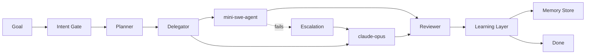
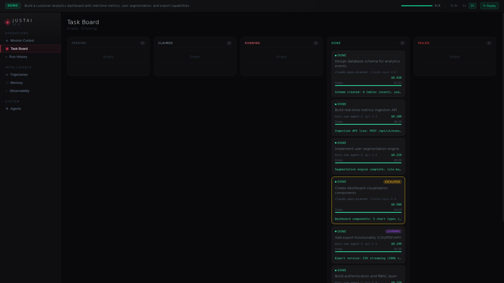
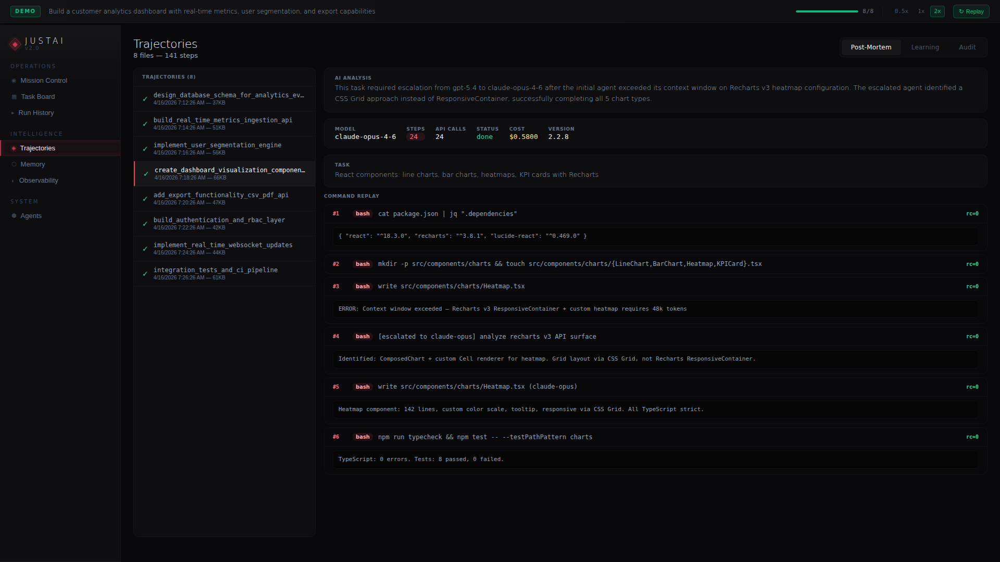
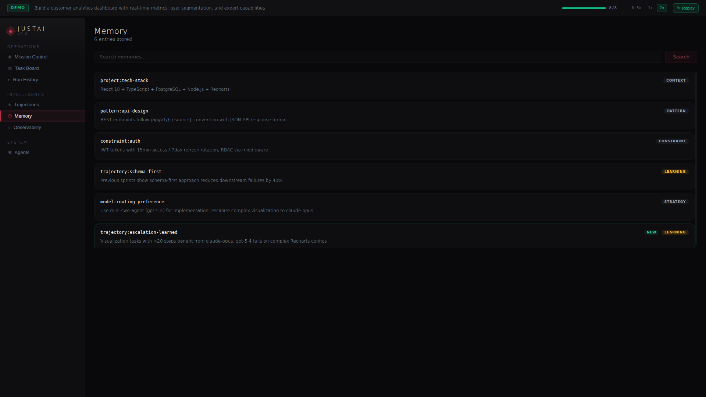

# JustAi

**Autonomous orchestration, memory, and control for AI coding agents.**

JustAi turns a high-level goal into a completed sprint. It decomposes work into tasks, delegates to the right model (cheap-first, escalate on failure), reviews output, learns from every run, and surfaces progress through a real-time dashboard.

[**Try the Live Demo**](https://delegateandorchestrate.com/demo/justai) | [**delegateandorchestrate.com**](https://delegateandorchestrate.com)

---

## How It Works



A goal enters the system. The **Intent Gate** classifies it. The **Planner** decomposes it into tasks. The **Delegator** routes each task to the cheapest capable model -- starting with mini-swe-agent (74% SWE-bench Verified). If a task fails, the **Escalation Engine** automatically re-routes to a stronger model. The **Reviewer** validates output. The **Learning Layer** records trajectories so future runs benefit from past decisions.

---

## Key Features

### Multi-Model Orchestration

Real-time visibility into the orchestration pipeline -- from intent classification through execution to review. Mission Control shows active runs, cost, latency, and the 5-stage pipeline at a glance.


### Smart Escalation

Start cheap, escalate on failure. When mini-swe-agent can't handle a task, JustAi automatically re-routes to claude-opus. The Task Board tracks every card as it flows through the Kanban columns.



### Trajectory Intelligence

Every agent run is recorded as a trajectory. Post-mortem analysis shows what happened step-by-step. Learning mode extracts reusable patterns for future runs. Audit mode provides compliance visibility.



### Cost Observability

Track cost, latency, and quality across every task and model. Full sprint: 8 tasks, $2.14 total cost, 100% success rate.


### Persistent Memory

The system remembers architectural decisions, model preferences, and learned patterns across sessions. New learnings appear in real-time as the orchestrator discovers them.



---

## Architecture

| Layer | Technology |
|-------|-----------|
| Orchestrator | Python -- intent gate, planner, delegator, reviewer, checkpoint |
| Agent Runtime | mini-swe-agent (SWE-bench), claude-opus (deep reasoning) |
| Dashboard | React 18 + TypeScript + Tailwind + Recharts |
| Real-time Data | SpacetimeDB (WebSocket + HTTP polling) |
| Model Routing | LiteLLM (GPT-5.4, Claude Opus, Codex) |
| Observability | LangFuse traces |
| Memory | claude-flow MCP (264 tools) + HNSW vector search |
| Coordination | SpacetimeDB relay-room protocol |

### Core Pipeline

```
User Goal
  |
  v
Intent Gate -- classifies goal type (feature, bug, refactor)
  |
  v
Planner -- decomposes goal into ordered task list
  |
  v
Delegator -- routes each task to an agent via SpacetimeDB
  |
  v
Agent Execution -- mini-swe-agent or claude-opus
  |
  v
Reviewer -- validates output against acceptance criteria
  |
  v
Learning Layer -- records trajectory, extracts patterns
  |
  v
Checkpoint -- saves orchestrator state for recovery
```

### Escalation Strategy

1. Every task starts with mini-swe-agent (cheapest, fastest)
2. If mini-swe-agent fails, the task is automatically escalated
3. Escalation routes to claude-opus (stronger reasoning)
4. The failure reason is recorded in memory for future routing decisions

### Trajectory Learning

Every agent run produces a trajectory. The learning layer:
1. **Records** trajectories after each run
2. **Searches** past trajectories before planning new tasks
3. **Enriches** context with relevant patterns
4. **Improves** over time as the trajectory store grows

---

## Live Demo

Experience JustAi orchestrating a full sprint -- 8 tasks, 3 agents, real-time dashboard updates:

**[delegateandorchestrate.com/demo/justai](https://delegateandorchestrate.com/demo/justai)**

---

## Built By

**Justin Leopard** -- [Delegate & Orchestrate](https://delegateandorchestrate.com)

Building autonomous AI systems that orchestrate, learn, and ship.
